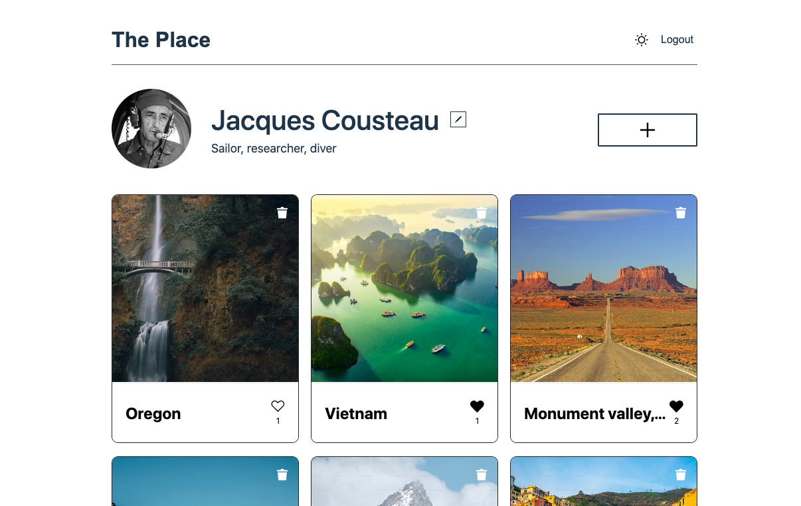

# The Place (FSD, React, Typescript, React Router, Context, Rest API, Vite)

Single page application (SPA) on React. Written with functional components on Typescript. User has access to authentication and the whole application functionality outside of the authorization:

- view feed of pictures from other users
- add your own pictures
- edit profile and user avatar
- change theme
- like, unlike and delete pictures
- validation of data on the application side
- user authentication and authorization with JWT token

## Tools used

- Featured slice design architecture
- Typescript
- React
- React Hook Form
- Yup form validation
- React Router
- React Context
- Rest API
- Vite

### Future plans for improvement

- Add toaster notification for UX
- Remove all minor any's types from code
- Change auth from JWT to cookies?

### Run and build project

You need to have Node.js installed.

- `npm start` for development
- `npm run build` for production
